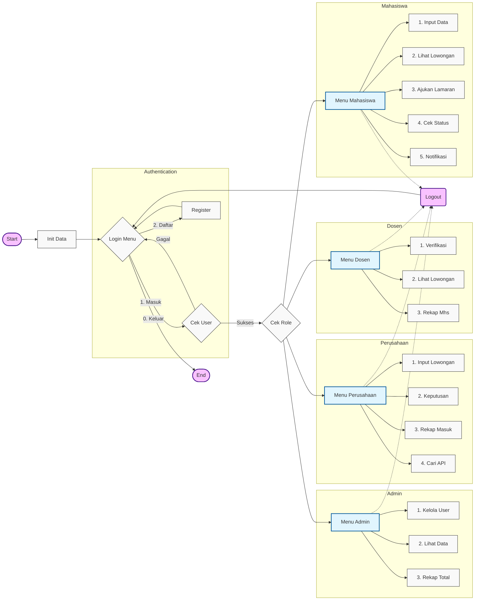

# Sistem Layanan Magang (ATS) - MLL Tipe B


Sistem Layanan Magang adalah aplikasi berbasis konsol (CLI) yang dibangun menggunakan bahasa C++ untuk memfasilitasi proses pelamaran kerja magang mahasiswa. Sistem ini menggunakan struktur data **Multi-Linked List (MLL)** untuk mengelola relasi antara Lowongan (Parent) dan Pelamar (Child).

## 🚀 Fitur Utama

### 1. Multi-Role System
- **Mahasiswa**: Input data diri, melihat lowongan, upload CV, dan menerima notifikasi penerimaan.
- **Dosen**: Memverifikasi lamaran mahasiswa dan melihat rekapitulasi pelamar.
- **Perusahaan**: Membuka lowongan, melihat skor ATS pelamar, review CV, dan memberikan keputusan (Terima/Tolak).
- **Admin**: Mengelola user dan melihat seluruh data sistem.

### 2. Applicant Tracking System (ATS) 🤖
- **CV Scoring**: Sistem otomatis memindai file CV (PDF/TXT) untuk mencari kata kunci relevan (misal: "C++", "Teamwork", "Python").
- **Binary Scanning**: Mendukung pembacaan raw content dari file PDF.
- **Skor**: Setiap kata kunci memberikan poin tambahan pada skor pelamar.

### 3. Manajemen File & CV 📂
- **Upload CV**: Mendukung pemilihan file native Windows (File Picker) untuk format `.pdf` dan `.txt`.
- **File Storage Simulation**: File yang diupload otomatis disalin ke folder lokal `uploads/` dengan penamaan terstruktur.
- **Auto-Cleanup**: Folder `uploads/` otomatis dibersihkan saat aplikasi ditutup untuk menghemat penyimpanan.
- **Integrated Review**: Perusahaan dapat membuka file CV pelamar langsung dari aplikasi sebelum memberikan keputusan.

### 4. Notifikasi Real-time 🔔
- Mahasiswa mendapatkan notifikasi "Pesan" di menu utama jika lamaran mereka diterima oleh perusahaan.

## 🛠️ Teknologi yang Digunakan
- **Bahasa**: C++ (Standard Library)
- **Struktur Data**: Multi-Linked List (MLL) Tipe B
- **OS API**: Windows API (`windows.h`, `commdlg.h`) untuk File Dialog dan File Operations.

## 📦 Cara Menjalankan

### Prasyarat
- Compiler C++ (MinGW / G++)
- Sistem Operasi Windows

### Instalasi & Run
1.  Clone repository ini.
2.  **Cara Mudah (Recommended):**
    Cukup klik dua kali file `run.bat` atau jalankan via terminal:
    ```bash
    ./run.bat
    ```
    Script ini akan otomatis melakukan compile dan menjalankan aplikasi.

3.  **Cara Manual (Alternatif):**
    Jika ingin compile sendiri:
    ```bash
    g++ src/*.cpp -Iinclude -o app.exe -lcomdlg32
    ./app.exe
    ```

## 👥 Akun Demo (Login)

| Role | Username | Password |
| :--- | :--- | :--- |
| **Mahasiswa** | `muhamadalwansuryadi` | `0104` |
| **Dosen** | `dosen1` | `dosen123` |
| **Perusahaan** | `techcorp` | `123` |
| **Admin** | `admin` | `admin123` |

## 📝 Struktur Data (MLL)
- **Parent**: Lowongan Pekerjaan (Double Linked List)
- **Child**: Data Mahasiswa (Single Linked List)
- **Relasi**: Lamaran (Single Linked List yang menghubungkan Parent & Child)

## 📊 Alur Program



---
*Dibuat untuk Tugas Besar Struktur Data - Telkom University.*
